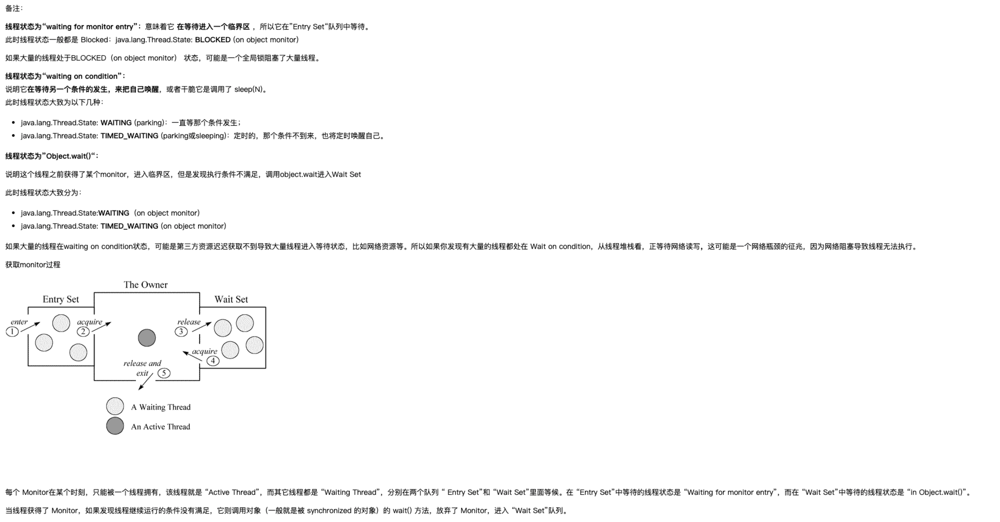

[Basic examples][http://www.51gjie.com/java/722.html]

A thread design_pattern.state. A thread can be in one of the following states:
- NEW 
    A thread that has not yet started is in this design_pattern.state.
- RUNNABLE
    A thread executing in the Java virtual machine is in this design_pattern.state.
- BLOCKED
    A thread that is blocked waiting for a monitor lock is in this design_pattern.state.
- WAITING
    A thread that is waiting indefinitely for another thread to perform a particular action is in this design_pattern.state.
- TIMED_WAITING
    A thread that is waiting for another thread to perform an action for up to a specified waiting time is in this design_pattern.state.
- TERMINATED
    A thread that has exited is in this design_pattern.state.
    
A thread can be in only one design_pattern.state at a given point in time. These states are virtual machine states which do not reflect any operating system thread states.

- 线程同步
- 线程间通信 wait
- 线程死锁
- 线程控制：挂起、停止和恢复 sleep